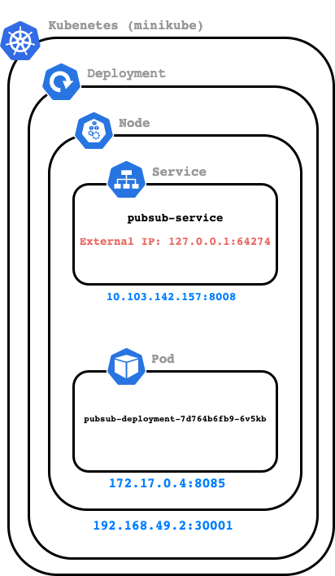

# Use Pub/Sub Emulator in minikube

**Note: Only single-node one-pod deployment is currently supported.**

1. Follow minikube [documentation] to install and start minikube.
2. In a terminal, apply minikube configuration to create deployment `gcp-emulator-deployment` and service `pubsub-service`.
   ```sh
   $ git clone https://github.com/anguillanneuf/pubsub-emulator-minikube.git
   $ cd pubsub-emulator-minikube
   $ kubectl apply -f pubsub-emulator-minikube.yaml
   ```
   You should see:
   ```
   deployment.apps/gcp-emulator-deployment created
   service/pubsub-service created
   ```
   Note: At the time of this `README.md` creation, `gcr.io/google.com/cloudsdktool/cloud-sdk:411.0.0-emulators` is used. Check for the latest release version in the public [container registry] for gcloud SDK.
3. Check if a pod is running, i.e. it should have an IP addresses assigned.
   ```
   $ kubectl get service
   $ kubectl describe service pubsub-service
   ```
   Example output where `Endpoints` has been populated:
   ```
   Name:                     pubsub-service
   Namespace:                default
   Labels:                   <none>
   Annotations:              <none>
   Selector:                 app=pubsub
   Type:                     NodePort
   IP:                       10.103.142.157
   Port:                     <unset>  8008/TCP
   TargetPort:               8085/TCP
   NodePort:                 <unset>  30001/TCP
   Endpoints:                172.17.0.4:8085
   Session Affinity:         None
   External Traffic Policy:  Cluster
   Events:                   <none>
   ```
   
4. Assign an external IP address for the service.
   ```
   $ minikube service pubsub-service 
   ```
   Example output where `192.168.49.2` is the IP address the Node and `127.0.0.1` is the external IP address of the service (as compared to `10.103.142.157` which is the internal IP address of the service).
   ```
   |-----------|----------------|-------------|---------------------------|
   | NAMESPACE |      NAME      | TARGET PORT |            URL            |
   |-----------|----------------|-------------|---------------------------|
   | default   | pubsub-service |        8008 | http://192.168.49.2:30001 |
   |-----------|----------------|-------------|---------------------------|
   🏃  Starting tunnel for service pubsub-service.
   |-----------|----------------|-------------|------------------------|
   | NAMESPACE |      NAME      | TARGET PORT |          URL           |
   |-----------|----------------|-------------|------------------------|
   | default   | pubsub-service |             | http://127.0.0.1:64274 |
   |-----------|----------------|-------------|------------------------|
   🎉  Opening service default/pubsub-service in default browser...
   ❗  Because you are using a Docker driver on darwin, the terminal needs to be open to run it.
   ```
5. In a second terminal, set the correct environment variables in order to create a topic and subscription in the dummy project and test publishing and receiving messages. Set `PUBSUB_PROJECT_ID` to the same value used in [`pubsub-emulator-minikube.yaml`](pubsub-emulator-minikube.yaml). Set `PUBSUB_EMULATOR_HOST` to the external IP address of the `pubsub-service` (in the example this value is `127.0.0.1:64274`).
   ```
   git cloud https://github.com/googleapis/python-pubsub.git
   cd python-pubsub/samples/snippets/
   export PUBSUB_PROJECT_ID=abc
   export PUBSUB_EMULATOR_HOST=127.0.0.1:64274
   python publisher.py abc create my-topic
   python subscriber.py abc create my-topic my-sub
   python publisher.py abc publish my-topic 
   ```

## Experiment with persistent volume

Using [`pv-experiment.yaml`](pv-experiment.yaml), I was able to mount a PV on each of the pods. I verified using the following command where `$POD` is the name of a running pod. However, when I interacted with `pubsub-service`, an existing topic could only be accessible some of the time, leading me to think that the different containers have no way of communicating to each other about the state of the message storage.

```sh
$ kubectl exec $POD -- ls -a /data/pv0001/
```

Conclusion: The Pub/Sub emulator is designed to work on a single machine. All the resources it creates (topics, subscriptions, snapshots, schemas) are simple Java hashmaps that don't communicate across machines. Therefore, using the emulator in a distributed way is not supported.

[documentation]: https://minikube.sigs.k8s.io/docs/start/
[container registry]: https://console.cloud.google.com/gcr/images/google.com:cloudsdktool/GLOBAL/cloud-sdk?gcrImageListsize=30
